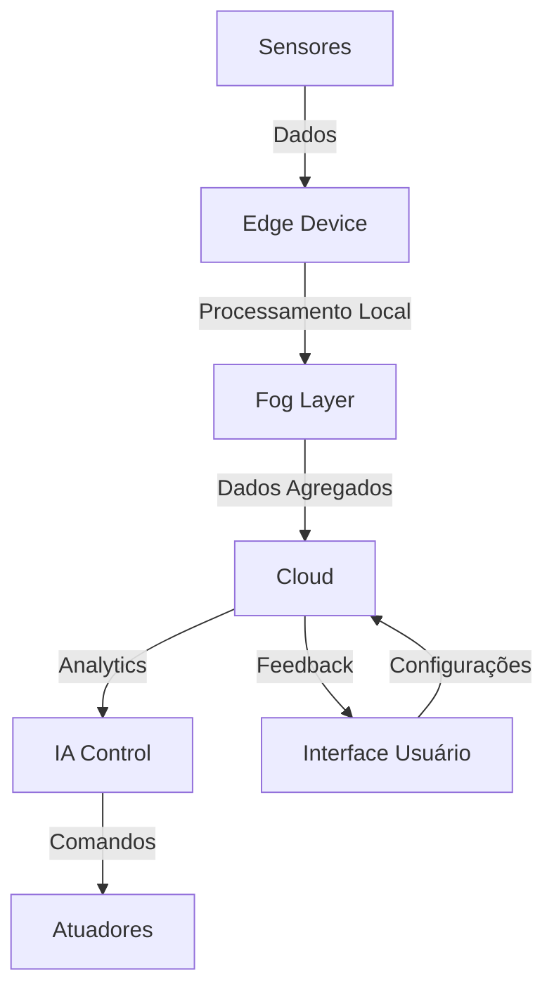

# Documentação Técnica - AIC (Artificial Intelligence Challenges)

## 1. Introdução

### 1.1 Contextualização
Com base no artigo "Methods and applications for Artificial Intelligence, Big Data, Internet of Things, and Blockchain in smart energy management", identificamos que:
- IA pode gerar economia de $5.8 trilhões até 2030
- Tecnologias digitais podem reduzir custos operacionais em 20%
- Previsão de crescimento de 147% em energia renovável nos próximos 30 anos

### 1.2 Objetivos
- Otimizar o consumo energético em ambientes residenciais
- Focar inicialmente em sistemas de ar condicionado
- Integrar IA, IoT e análise de dados
- Reduzir custos e aumentar eficiência

### 1.3 Escopo
- Monitoramento e controle de ar condicionado
- Interface com usuário
- Sistema de otimização baseado em IA
- Coleta e análise de dados

## 2. Arquitetura da Solução

### 2.1 Visão Geral

### 2.2 Componentes Principais
1. Camada de Sensoriamento
   - Temperatura (interno/externo)
   - Umidade
   - Presença
   - Consumo energético

2. Camada de Processamento
   - Edge: ESP32
   - Fog: Processamento intermediário
   - Cloud: Análise avançada

3. Camada de Controle
   - Algoritmos de IA
   - Sistema de regras
   - Otimização em tempo real

## 3. Análise do Equipamento

### 3.1 Características Técnicas
- Potência média: 1500W
- Tensão: 220V
- Corrente: ~7A
- Capacidade: 12000 BTUs
- Eficiência energética: Classe A

### 3.2 Padrões de Uso
- Uso diário: 8-12 horas
- Picos: 13h-15h e 19h-22h
- Temperatura média: 23°C
- Variação: ±2°C

### 3.3 Oportunidades de Otimização
- Redução de 20-30% no consumo
- Economia mensal: R$ 150-200
- Payback: 12-15 meses
- ROI anual: 80-100%

## 4. Tecnologias Aplicadas

### 4.1 Inteligência Artificial
- Previsão de demanda
- Otimização de consumo
- Detecção de padrões
- Manutenção preditiva

### 4.2 Internet das Coisas
- Rede de sensores
- Comunicação em tempo real
- Processamento distribuído
- Atuação remota

### 4.3 Análise de Dados
- Coleta contínua
- Processamento em tempo real
- Análise histórica
- Geração de insights

## 5. Implementação

### 5.1 Requisitos de Hardware
- ESP32 como controlador
- Sensores de temperatura/umidade
- Sensor de presença
- Medidor de consumo

### 5.2 Requisitos de Software
- Sistema de controle em Python
- Interface web
- APIs REST
- Banco de dados Oracle

### 5.3 Integração
- Protocolo MQTT
- APIs REST
- Websockets
- Banco de dados

## 6. Resultados Esperados

### 6.1 Métricas de Economia
- Redução de consumo: 20-30%
- Economia financeira: R$ 150-200/mês
- Payback: 12-15 meses

### 6.2 Métricas de Eficiência
- Tempo de resposta < 5s
- Precisão > 90%
- Uptime > 99.9%

### 6.3 Impacto Ambiental
- Redução de emissões de CO2
- Uso mais eficiente de energia
- Suporte a fontes renováveis

## 7. Considerações de Segurança

### 7.1 Proteção de Dados
- Criptografia em trânsito
- Autenticação robusta
- Autorização por níveis

### 7.2 Redundância
- Backup de dados
- Fallback manual
- Monitoramento contínuo

## 8. Próximos Passos

### 8.1 Desenvolvimento
1. Implementação do circuito IoT
2. Desenvolvimento do sistema de controle
3. Integração com análise de dados
4. Testes e validação

### 8.2 Expansão
1. Outros equipamentos
2. Mais locais
3. Novas funcionalidades
4. Melhorias contínuas

## 9. Referências
1. LI, Joey et al. Methods and applications for Artificial Intelligence, Big Data, Internet of Things, and Blockchain in smart energy management. Energy and AI, v. 11, p. 100208, 2023.
2. Análises e estudos internos do projeto
3. Documentação técnica dos equipamentos
4. Normas e padrões relevantes
