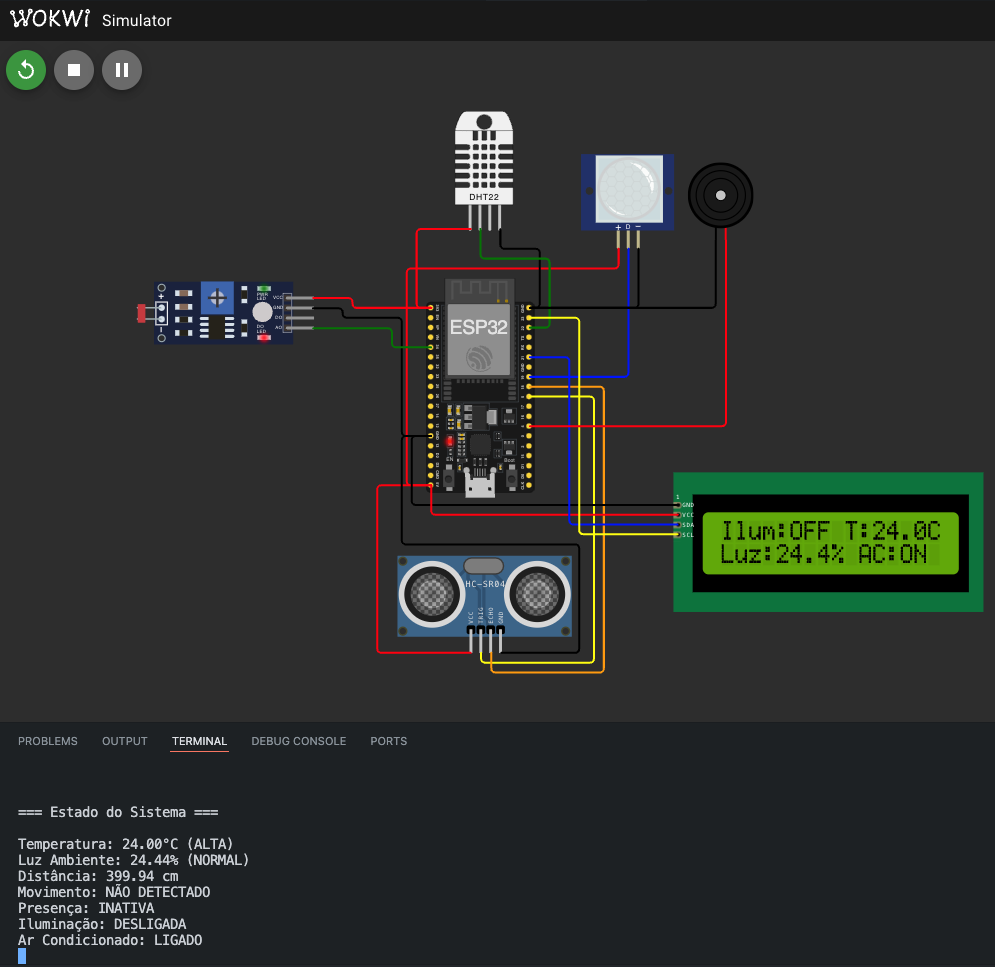
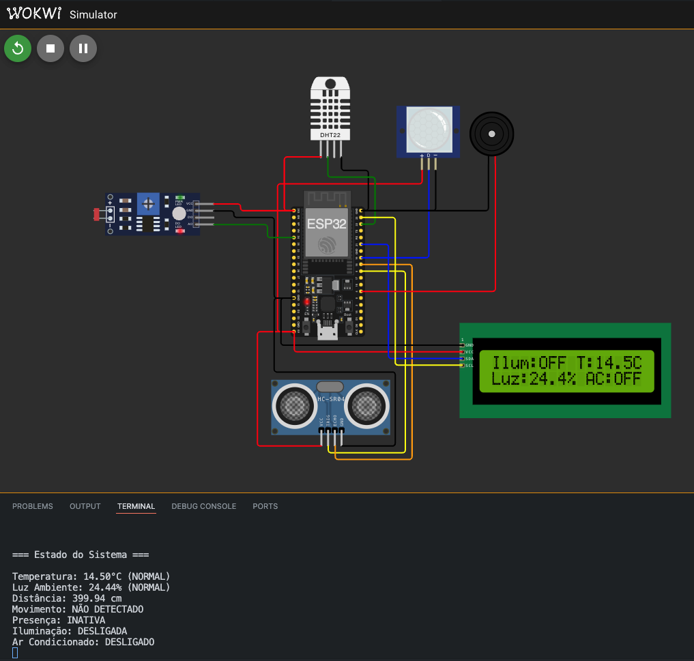
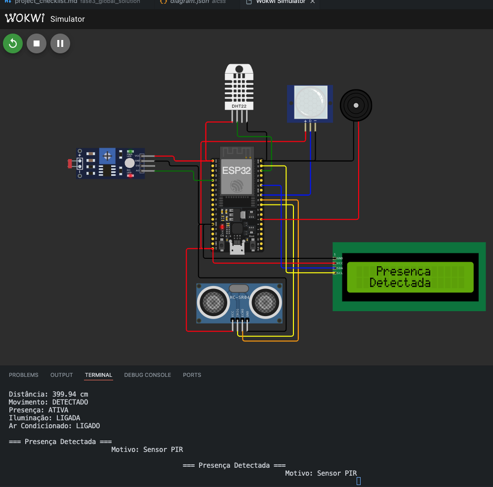
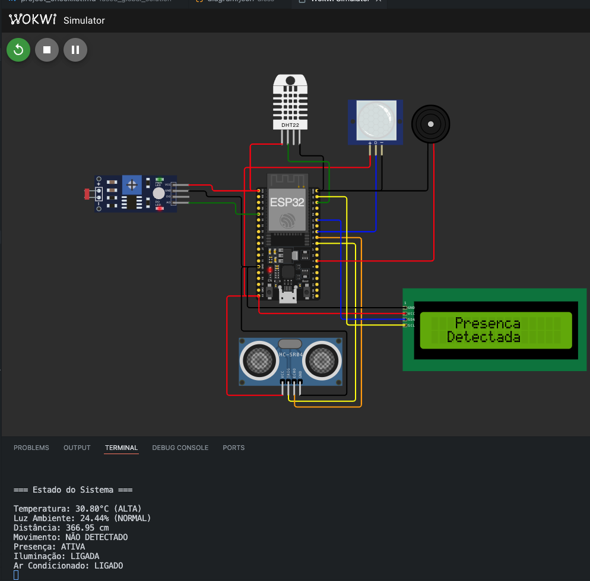
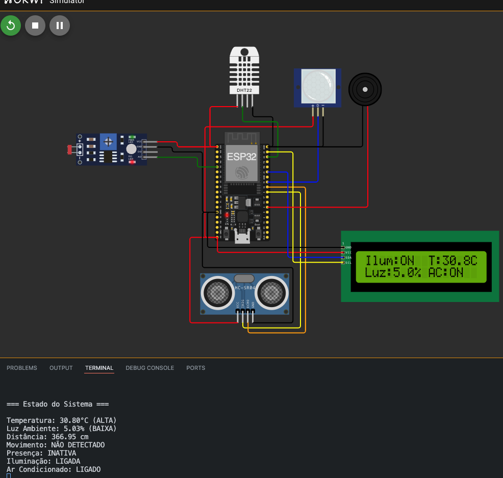

# AICSS - Automated Illumination and Climate Smart System

Sistema automatizado para controle inteligente de iluminação e climatização baseado em sensores, desenvolvido para o ESP32.

## Visão Geral

O AICSS é um sistema IoT que automatiza o controle de iluminação e climatização de ambientes, utilizando múltiplos sensores para detectar presença, luminosidade e temperatura. O sistema visa otimizar o consumo de energia mantendo o conforto dos usuários.

## Configuração do Projeto

### Wokwi Projeto
https://wokwi.com/projects/415564563445914625

### Plataforma
- Board: ESP32 DOIT DevKit V1
- Framework: Arduino
- Platform: Espressif 32

### Dependências
```ini
lib_deps = 
    adafruit/DHT sensor library@^1.4.6
    marcoschwartz/LiquidCrystal_I2C@^1.1.4
    adafruit/Adafruit Unified Sensor@^1.1.14
```

### Configurações PlatformIO
```ini
monitor_speed = 115200
monitor_filters = 
    colorize
    time
    send_on_enter
build_flags = 
    -D CORE_DEBUG_LEVEL=5
    -D CONFIG_ARDUHAL_LOG_COLORS=1
upload_speed = 921600
```

### Notas de Hardware
- O LCD opera via protocolo I2C no endereço 0x27
- O LDR utiliza um divisor de tensão para leitura analógica
- O sensor PIR tem um tempo de warm-up inicial
- Amostragem do LDR: 5 leituras com 10ms entre cada (50ms total)
- Os relés iniciam desligados (LOW)
- Os relés são acionados em lógica normal (HIGH para ligar)

## Componentes de Hardware

- ESP32 (Microcontrolador)
- DHT22 (Sensor de Temperatura)
- HC-SR04 (Sensor Ultrassônico)
- PIR (Sensor de Movimento)
- LDR (Sensor de Luminosidade)
- Display LCD I2C 16x2
- Relé para Iluminação (GPIO26)
- Relé para Ar Condicionado (GPIO27)

### Diagrama de Conexões

O projeto utiliza o simulador Wokwi para prototipagem. Abaixo estão as conexões detalhadas de cada componente:

#### DHT22 (Temperatura)
- VCC → ESP32 3V3
- GND → ESP32 GND
- SDA → ESP32 GPIO22

#### HC-SR04 (Ultrassônico)
- VCC → ESP32 5V
- GND → ESP32 GND
- TRIG → ESP32 GPIO5
- ECHO → ESP32 GPIO18

#### PIR (Sensor de Movimento)
- VCC → ESP32 5V
- GND → ESP32 GND
- OUT → ESP32 GPIO19

#### LDR (Sensor de Luz)
- VCC → ESP32 3V3
- GND → ESP32 GND
- OUT → ESP32 GPIO34 (ADC)

#### Relé (Iluminação)
- VCC → ESP32 5V
- GND → ESP32 GND
- IN → ESP32 GPIO26

#### Relé (Ar Condicionado)
- VCC → ESP32 5V
- GND → ESP32 GND
- IN → ESP32 GPIO27

## Funcionalidades

### 1. Controle de Iluminação
- Ativação automática baseada em presença
- Desligamento automático após 5 segundos sem detecção
- Ativação quando luz ambiente < 10%
- Desativação quando luz ambiente > 10% (se não houver presença)

### 2. Detecção de Presença
- Sensor PIR para movimento
- Sensor ultrassônico para mudanças de distância
- Detecção de passagem (mudança > 20cm)
- Timer de presença com timeout de 5 segundos

### 3. Controle de Climatização
- Ativação automática acima de 22°C
- Desativação quando temperatura normaliza
- Monitoramento contínuo de temperatura

### 4. Interface
- Display LCD com 2 modos:
  - Modo Presença: Exibe status centralizado
  - Modo Normal: Exibe temperatura, luminosidade e estados
- Log detalhado via Serial (115200 baud)
- Monitor colorizado com timestamp

## Instalação

1. Instale PlatformIO no VS Code
2. Clone este repositório
3. Abra o projeto no VS Code com PlatformIO
4. Instale as dependências (automático via PlatformIO)
5. Conecte os componentes conforme pinagem
6. Compile e faça upload para o ESP32

## Thresholds e Parâmetros

- Luz Mínima: 10%
- Temperatura Máxima: 22°C
- Timeout de Presença: 5 segundos
- Detecção de Movimento: 20cm de variação
- Amostragem LDR: 5 leituras por média

## Monitoramento

O sistema fornece logs detalhados via Serial (115200 baud):

### Log Periódico (1 segundo)
```
=== Estado do Sistema ===

Temperatura: 23.50°C (ALTA)
Luz Ambiente: 45.20% (NORMAL)
Distância: 150.30 cm
Movimento: NÃO DETECTADO
Presença: INATIVA
Iluminação: DESLIGADA
Ar Condicionado: LIGADO
```

### Logs de Eventos
```
=== Mudança na Distância ===
Anterior: 150.30cm
Atual: 180.50cm

=== Presença Detectada ===
Motivo: Sensor PIR

=== Iluminação LIGADA ===

=== Ar Condicionado LIGADO ===
Temperatura: 23.50°C

=== Timeout de Presença ===
Status: Presença Finalizada
```

## Temporização

- Timeout de Presença: 5 segundos
- Log de Estado: 1 segundo
- Delay Principal: 500ms
- Amostragem LDR: 10ms entre leituras

## Display LCD

### Modo Presença
```
   Presenca
  Detectada
```

### Modo Normal
```
Ilum:ON T:23.5C
Luz:45% AC:OFF
```

## Screenshots

### Interface LCD e Estados do Sistema

#### Modo Normal

Display LCD mostrando temperatura, iluminação, luz ambiente e estado do ar condicionado em operação normal.

#### Detecção de Presença

Display LCD centralizado mostrando status quando presença é detectada.

#### Temperatura Alta

Sistema ativa automaticamente o ar condicionado quando a temperatura excede 22°C.

#### Baixa Luminosidade

Sistema ativa a iluminação quando a luz ambiente cai abaixo de 10%.

#### Monitoramento via Serial

Logs detalhados mostrando estados dos sensores, eventos e mudanças no sistema.

## Debug

O sistema inclui debug avançado:
- Nível de debug: 5 (máximo)
- Logs colorizados
- Timestamp em cada mensagem
- Monitor Serial interativo (send_on_enter)

## Contribuição

1. Faça um Fork
2. Crie uma Branch (`git checkout -b feature/AmazingFeature`)
3. Commit suas mudanças (`git commit -m 'Add some AmazingFeature'`)
4. Push para a Branch (`git push origin feature/AmazingFeature`)
5. Abra um Pull Request
