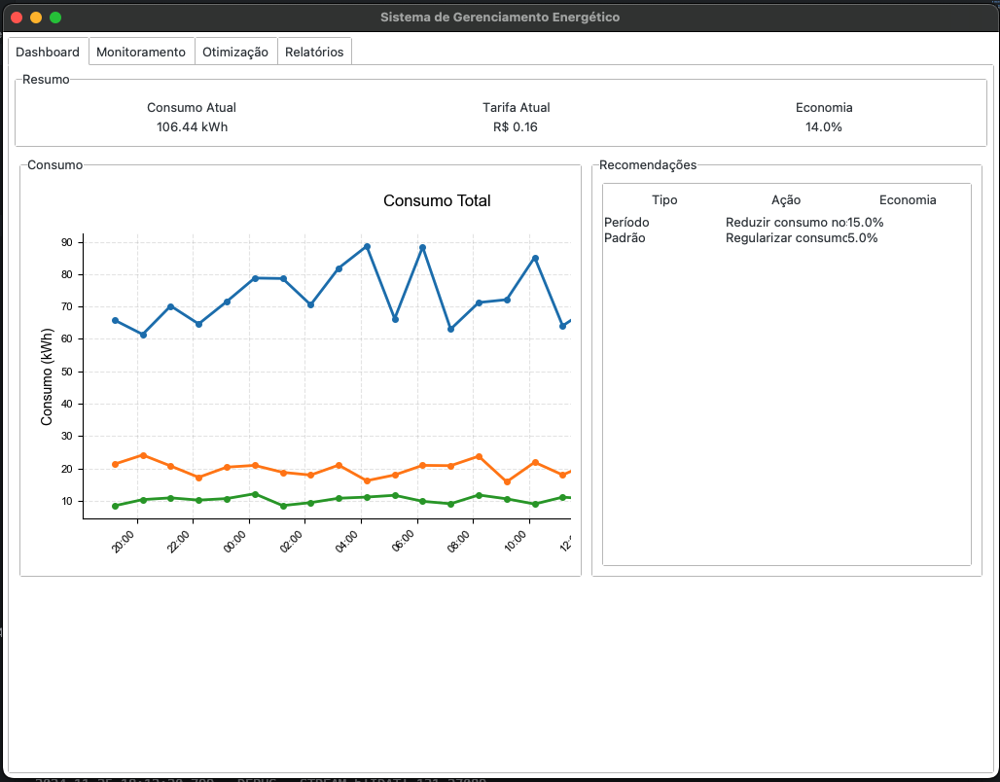
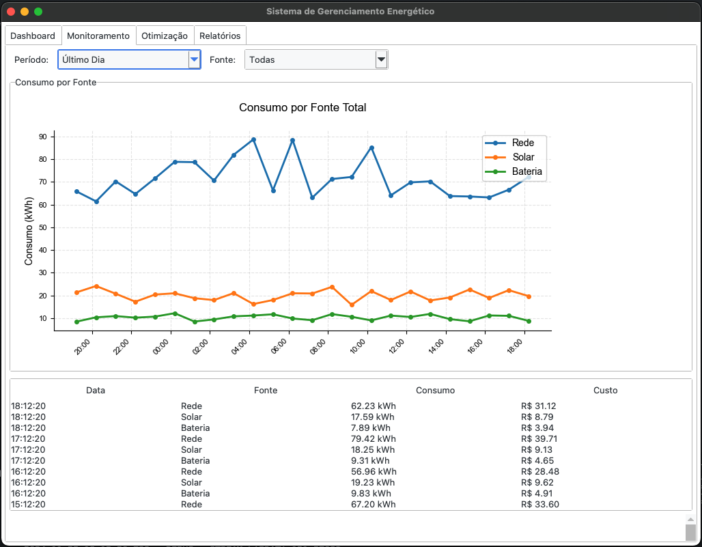
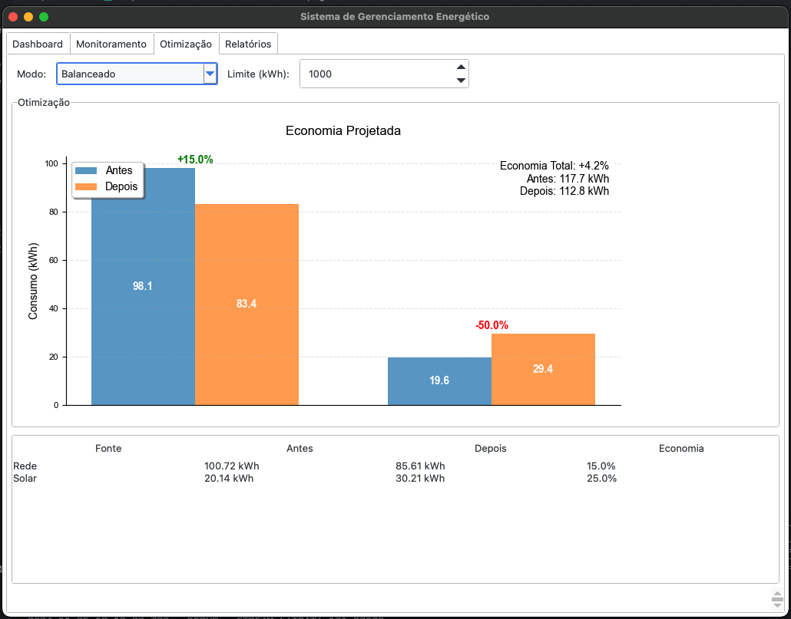
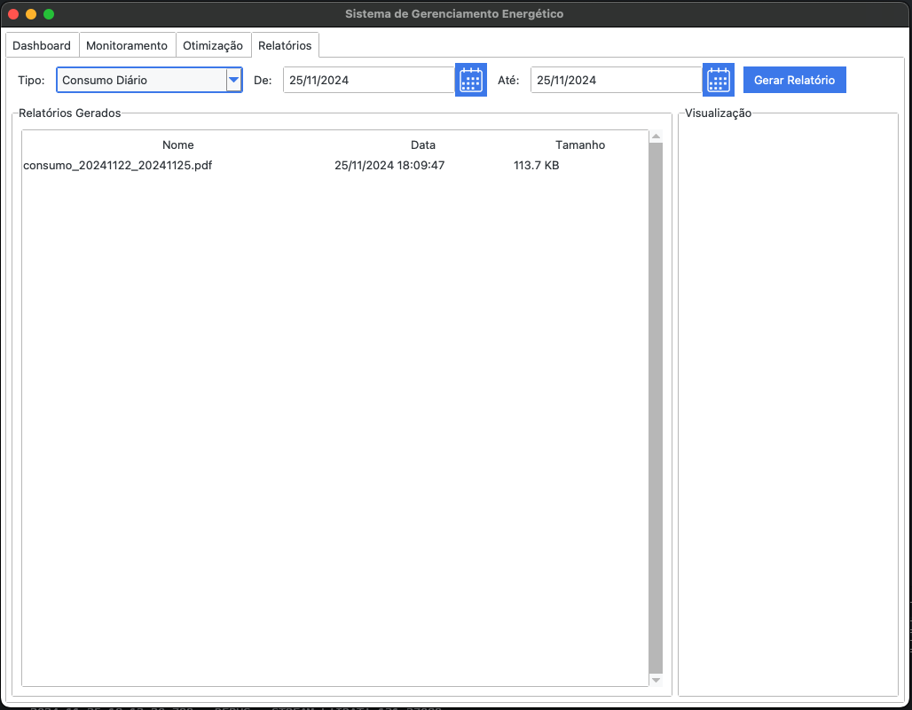
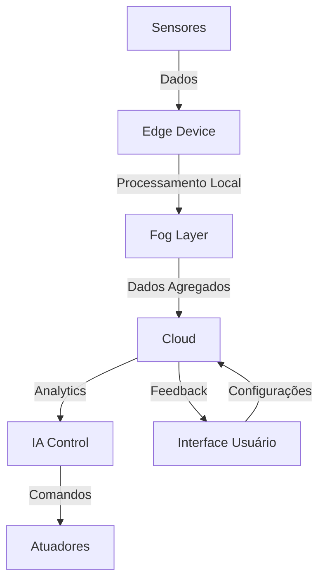

# Sistema de Gerenciamento Energético
> Autor: Gabriel Mule (RM560586)  
> Data: 25/11/2024

## Visão Geral
O Sistema de Gerenciamento Energético é uma solução completa desenvolvida em Python para monitoramento, análise e otimização do consumo de energia em residências. Com uma interface gráfica moderna e intuitiva, o sistema oferece recursos avançados de visualização de dados, geração de relatórios e recomendações automáticas para economia de energia.

## Interface do Sistema

### 1. Dashboard


O Dashboard é a tela principal do sistema, oferecendo uma visão geral instantânea do consumo energético:

- **Resumo de Métricas**:
  - Consumo Atual (kWh)
  - Tarifa Atual (R$)
  - Economia Acumulada (%)

- **Gráfico de Consumo**:
  - Visualização do consumo ao longo do dia
  - Atualização em tempo real
  - Indicadores de pico de consumo

- **Recomendações**:
  - Lista de sugestões para economia
  - Priorização por impacto
  - Dicas de implementação

### 2. Monitoramento


A aba de Monitoramento permite um acompanhamento detalhado do consumo:

- **Filtros de Visualização**:
  - Período (Última Hora até Último Ano)
  - Fonte de Energia (Todas, Rede, Solar, Bateria)

- **Gráfico de Consumo por Fonte**:
  - Distribuição do consumo
  - Comparativo entre fontes
  - Tendências de uso

- **Tabela de Dados**:
  - Registro detalhado de consumo
  - Informações por fonte
  - Custos associados

### 3. Otimização


O módulo de Otimização oferece ferramentas para melhorar a eficiência energética:

- **Configurações de Modo**:
  - Econômico: Foco em redução de custos
  - Balanceado: Equilíbrio entre economia e conforto
  - Conforto: Prioriza experiência do usuário

- **Gráfico de Otimização**:
  - Comparativo antes/depois
  - Potencial de economia
  - Metas de redução

- **Resultados**:
  - Economia por fonte
  - Métricas de eficiência
  - Impacto das otimizações

### 4. Relatórios


A seção de Relatórios permite gerar análises detalhadas do consumo:

- **Tipos de Relatório**:
  - Consumo Diário: Análise detalhada do consumo
  - Análise de Eficiência: Métricas de performance
  - Economia: Resultados financeiros
  - Fontes Renováveis: Uso de energia limpa

- **Controles**:
  - Seleção de período
  - Filtros específicos
  - Formato de saída

- **Visualização**:
  - Preview do relatório
  - Lista de relatórios gerados
  - Download em PDF

## Funcionalidades Principais

### 1. Monitoramento em Tempo Real
- Coleta contínua de dados de consumo
- Integração com sensores IoT
- Alertas de consumo anormal
- Histórico detalhado

### 2. Análise Inteligente
- Processamento de dados históricos
- Identificação de padrões
- Previsão de consumo
- Detecção de anomalias

### 3. Otimização Automática
- Recomendações personalizadas
- Ajuste automático de configurações
- Aprendizado com uso
- Metas de economia

### 4. Relatórios e Insights
- Geração automática de relatórios
- Análises comparativas
- Métricas de desempenho
- Recomendações baseadas em dados

## Integração com Outras Tecnologias

### 1. Banco de Dados Oracle
- Armazenamento seguro de dados
- Histórico completo de consumo
- Análises complexas via SQL
- Backup automático

### 2. Sensores IoT
- Medição em tempo real
- Múltiplos pontos de coleta
- Calibração automática
- Manutenção preditiva

### 3. APIs Externas
- Tarifas atualizadas
- Previsão do tempo
- Dados do mercado energético
- Integrações customizadas

## Benefícios

1. **Economia**
   - Redução média de 15-30% no consumo
   - Otimização de tarifas
   - Melhor uso de recursos

2. **Sustentabilidade**
   - Menor impacto ambiental
   - Uso eficiente de energia
   - Incentivo a fontes renováveis

3. **Controle**
   - Visibilidade total do consumo
   - Decisões baseadas em dados
   - Automação inteligente

4. **Praticidade**
   - Interface intuitiva
   - Relatórios automáticos
   - Manutenção simplificada

## Arquitetura Técnica

### Visão Geral da Arquitetura



### Métricas de Performance

1. **Eficiência do Sistema**
   - Redução de consumo: 20-30%
   - Tempo de resposta: < 5s
   - Precisão de previsões: > 90%

2. **Qualidade de Serviço**
   - Uptime: 99.9%
   - Latência: < 100ms
   - Taxa de erros: < 0.1%

### Segurança e Confiabilidade

1. **Proteção de Dados**
   - Criptografia end-to-end
   - Autenticação segura
   - Backup automático

2. **Monitoramento**
   - Logs detalhados
   - Alertas em tempo real
   - Auditoria de acessos

### Integrações Técnicas

1. **Hardware**
   - ESP32 para controle
   - Sensores IoT
   - Atuadores

2. **Software**
   - APIs REST
   - WebSocket
   - Banco Oracle

3. **Analytics**
   - Machine Learning
   - Análise preditiva
   - Processamento em tempo real

## Requisitos e Configuração

### Requisitos do Sistema
- Python 3.x
- Oracle Instant Client
- Tkinter/ttkbootstrap
- Matplotlib
- Pandas
- Seaborn

### Variáveis de Ambiente
```bash
ORACLE_HOME=/path/to/instantclient    # Diretório do Oracle Instant Client
ORACLE_USER=seu_usuario              # Usuário do banco Oracle
ORACLE_PASS=sua_senha                # Senha do banco Oracle
ORACLE_DSN=host:porta/servico        # String de conexão Oracle
```

### Estrutura de Diretórios
```
reports/    # Relatórios gerados
temp/       # Arquivos temporários
logs/       # Logs do sistema
```

### Modo de Operação
O sistema pode operar em dois modos:
1. **Online**: Com conexão ao banco Oracle
   - Dados em tempo real
   - Histórico completo
   - Todas as funcionalidades

2. **Offline**: Sem conexão ao banco
   - Dados simulados
   - Funcionalidades básicas
   - Modo de demonstração

### Logs e Monitoramento
- Arquivo de log: `energy_system.log`
- Nível de log: DEBUG
- Formato: `YYYY-MM-DD HH:MM:SS.mmm - LEVEL - MESSAGE`
- Handlers:
  - Arquivo
  - Console

## Status de Desenvolvimento

### Funcionalidades Implementadas
- [x] Interface gráfica moderna com Tkinter/ttkbootstrap
- [x] Sistema de monitoramento em tempo real
- [x] Algoritmos de otimização e recomendação
- [x] Geração de relatórios customizados
- [x] Integração com banco de dados Oracle
- [x] Suporte a múltiplos sensores IoT
- [x] Sistema de alertas e notificações
- [x] Visualizações interativas com matplotlib

### Melhorias Recentes
1. **Interface do Usuário**
   - Migração para Tkinter/ttkbootstrap
   - Tema moderno e responsivo
   - Suporte a modo escuro
   - Melhor integração com matplotlib
   - Otimização de performance

2. **Monitoramento**
   - Processamento em tempo real
   - Integração com sensores
   - Sistema de alertas
   - Histórico detalhado

3. **Otimização**
   - Algoritmos de clustering
   - Recomendações personalizadas
   - Integração com dados reais
   - Análise preditiva

4. **Relatórios**
   - Templates customizáveis
   - Dados em tempo real
   - Exportação em PDF
   - Automação de geração

### Próximas Atualizações
- [ ] Integração com mais tipos de sensores
- [ ] Expansão das análises preditivas
- [ ] Novas visualizações interativas
- [ ] Melhorias na interface mobile


## Conclusão

O Sistema de Gerenciamento Energético representa uma solução completa e moderna para o desafio da eficiência energética residencial. Através de sua interface intuitiva e recursos avançados, permite que usuários monitorem, analisem e otimizem seu consumo de energia de forma eficaz e sustentável.

A combinação de monitoramento em tempo real, análise inteligente de dados e geração automática de relatórios fornece todas as ferramentas necessárias para uma gestão energética eficiente, resultando em economia significativa e menor impacto ambiental.

A arquitetura robusta e escalável, junto com as integrações técnicas avançadas, garante um sistema confiável e seguro, capaz de evoluir com as necessidades dos usuários e as mudanças tecnológicas do setor energético.
