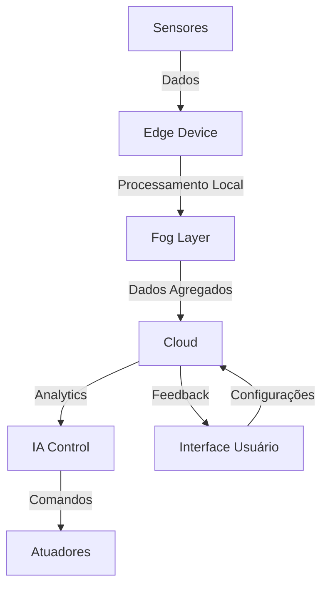

# Documentação Técnica Principal

## Visão Geral
Sistema de gerenciamento inteligente para otimização do consumo energético em ambientes residenciais, comerciais ou urbanos, com foco inicial em sistemas de ar condicionado.

## Objetivos do Sistema
1. Monitorar, prever e agendar uso de recursos energéticos
2. Manter comunicação bidirecional com a rede
3. Facilitar trading de energia
4. Armazenar, processar e comunicar dados relevantes

## Arquitetura Geral

## Componentes Principais

### 1. Camada de Hardware (AICSS)
- ESP32 como controlador principal
- Sensores de temperatura, umidade e presença
- Sistema de ar condicionado como caso de estudo

### 2. Camada de Dados (CDS)
- Banco de dados Oracle
- Pipeline de processamento
- Análise histórica

### 3. Camada de Análise (SCR)
- Análise estatística
- Modelos preditivos
- Visualizações

### 4. Camada de Controle (CTWP)
- Sistema Python
- APIs REST
- Interface do usuário

## Métricas Globais do Sistema

### KPIs Principais
1. Eficiência Energética
   - Redução de consumo: 20-30%
   - Tempo de resposta: < 5s
   - Precisão de previsões: > 90%

2. Conforto do Usuário
   - Desvio máximo de temperatura: ±1°C
   - Tempo de ajuste: < 10min
   - Satisfação do usuário: > 90%

3. Performance Técnica
   - Uptime: 99.9%
   - Latência: < 100ms
   - Taxa de erros: < 0.1%

## Roadmap de Implementação

### Fase 1 - Fundação (AIC)
- [x] Análise do artigo base
- [x] Seleção de equipamento
- [x] Documentação inicial

### Fase 2 - Desenvolvimento
- [ ] Implementação do circuito (AICSS)
- [ ] Análise estatística (SCR)
- [ ] Setup do banco de dados (CDS)
- [ ] Desenvolvimento Python (CTWP)

### Fase 3 - Integração
- [ ] Testes integrados
- [ ] Validação do sistema
- [ ] Documentação final

## Considerações de Segurança
1. Criptografia de dados
2. Autenticação de dispositivos
3. Backup e recuperação
4. Monitoramento de segurança

## Manutenção e Suporte
1. Monitoramento contínuo
2. Atualizações de firmware
3. Backup de dados
4. Suporte ao usuário

## Anexos e Referências
- Documentação detalhada em cada subdiretório do projeto
- Códigos fonte no GitHub
- Diagramas técnicos em /assets/images
- Datasets em /assets/data
