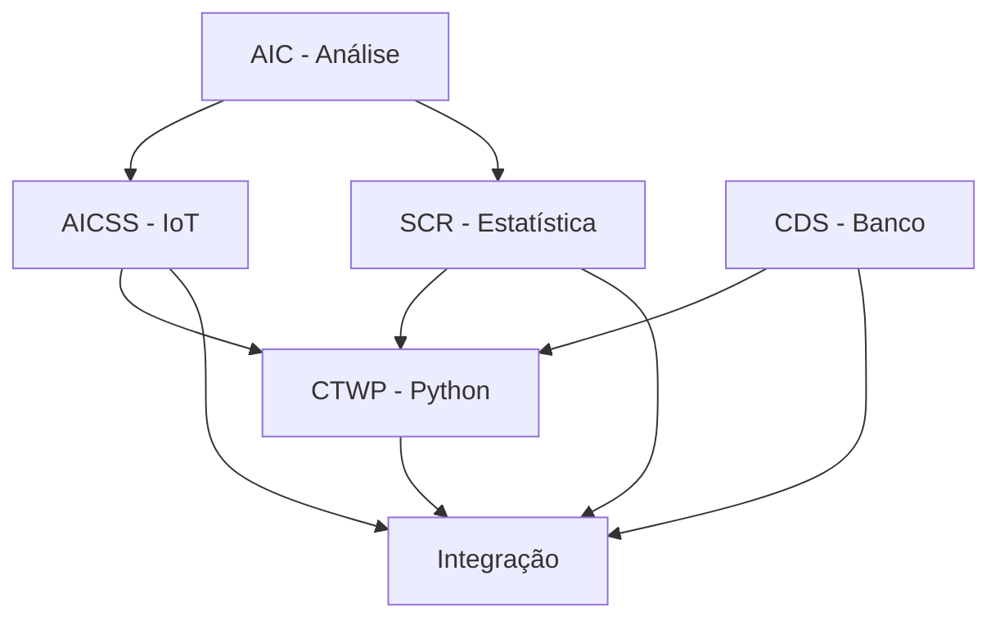

# Plano de Projeto - Otimização de Consumo Energético
## Visão Geral

Este documento detalha o planejamento para desenvolvimento de uma solução integrada de otimização de consumo energético, atendendo aos requisitos da Global Solutions 2024.2. O projeto visa desenvolver uma solução baseada em Data Science, IoT, Python e Banco de Dados para otimização do consumo de energia em ambientes residenciais, comerciais ou urbanos.

## Equipe
- Gabriel Mule (RM560586)

## Estrutura do Projeto

### 1. Análise e Documentação Inicial (AIC - 10%)
- [ ] Estudo aprofundado do artigo científico
  - Análise detalhada do artigo "A comprehensive review of artificial intelligence-based building energy use prediction" (https://www.sciencedirect.com/science/article/pii/S2666546822000544)
  - Extração de insights sobre:
    - Técnicas de IA para previsão de consumo
    - Métodos de otimização energética
    - Fatores que influenciam o consumo
    - Métricas de avaliação
    - Desafios e limitações
  - Mapeamento de tecnologias aplicáveis ao projeto
- [ ] Seleção e análise de equipamento específico
  - Critérios de seleção:
    - Alto consumo energético
    - Uso frequente
    - Potencial de otimização
  - Análise detalhada:
    - Padrões de uso
    - Consumo atual
    - Perfil de carga
    - Oportunidades de economia
    - Impacto na vida útil
- [ ] Desenvolvimento da documentação técnica
  - Introdução
    - Contextualização do problema energético
    - Objetivos específicos e mensuráveis
    - Escopo do projeto
  - Desenvolvimento
    - Arquitetura detalhada da solução
    - Justificativa técnica para cada tecnologia
    - Diagramas de integração
    - Fluxos de dados
    - Protocolos de comunicação
  - Resultados Esperados
    - Métricas de economia
    - KPIs de eficiência
    - Análise de ROI
    - Impacto ambiental
  - Conclusões
    - Síntese dos benefícios
    - Próximos passos
    - Recomendações

### 2. Desenvolvimento do Circuito IoT (AICSS - 20%)
- [ ] Análise inicial de pontos de consumo
  - Mapeamento de áreas críticas
    - Ambientes internos
    - Áreas externas
    - Zonas de segurança
  - Estudo de luminosidade
    - Níveis mínimos para câmeras
    - Variação ao longo do dia
    - Requisitos de segurança
- [ ] Projeto detalhado do circuito no Wokwi
  - Componentes principais:
    - ESP32
      - Configuração WiFi
      - Setup de GPIO
      - Modo deep sleep
    - Sensor LDR (Light Dependent Resistor)
      - Calibração
      - Faixas de operação
      - Posicionamento
    - Sensor Ultrassônico HC-SR04
      - Configuração de distância
      - Zonas de detecção
      - Filtro de ruído
    - LEDs
      - Controle PWM
      - Níveis de intensidade
      - Consumo energético
  - Sistema de iluminação noturna
    - Algoritmo adaptativo
      - Thresholds de luminosidade
      - Transições suaves
      - Modo economia
    - Controle de segurança
      - Nível mínimo para câmeras
      - Detecção de movimento
      - Override manual
  - Sensores adicionais:
    - Sensor de corrente ACS712
      - Medição de consumo
      - Calibração
    - Sensor DHT22
      - Temperatura
      - Umidade
    - PIR HC-SR501
      - Detecção de presença
      - Zonas de cobertura
- [ ] Desenvolvimento do firmware
  - Setup inicial
    - Configuração PlatformIO
    - Estrutura do projeto
    - Bibliotecas necessárias
  - Implementação core
    - Sistema de controle
    - Coleta de dados
    - Processamento local
    - Comunicação WiFi
  - Algoritmos específicos
    - Controle adaptativo de luz
    - Economia de energia
    - Modo segurança
  - Sistema de logs
    - Registro de eventos
    - Métricas de operação
    - Debug
  - Testes
    - Unitários
    - Integração
    - Stress test
    - Calibração
- [ ] Documentação técnica
  - Esquemático do circuito
  - Pinout detalhado
  - Fluxogramas
  - Protocolos
  - Guia de manutenção
- [ ] Vídeo demonstrativo
  - Configurações:
    - Modo "não listado" YouTube
    - Qualidade HD
    - Áudio claro
  - Conteúdo:
    - Overview do sistema
    - Demonstração funcional
    - Testes práticos
    - Resultados obtidos

### 3. Análise Estatística (SCR - 20%)
- [ ] Análise das bases ANEEL
  - Acesso ao portal de dados abertos: https://dadosabertos.aneel.gov.br/organization/
  - Avaliação das 67 entidades disponíveis:
    - Relevância para o projeto
    - Qualidade dos dados
    - Periodicidade
    - Granularidade
  - Critérios de seleção:
    - Cobertura temporal
    - Completude
    - Confiabilidade
    - Aplicabilidade
- [ ] Análise exploratória em R
  - Preparação dos dados
    - Limpeza
    - Normalização
    - Tratamento de outliers
  - Estatística descritiva
    - Medidas centrais
    - Dispersão
    - Distribuições
  - Análise temporal
    - Tendências
    - Sazonalidade
    - Ciclos
  - Visualizações
    - Histogramas
    - Box plots
    - Séries temporais
    - Correlações
- [ ] Análise socioeconômica
  - Indicadores sociais
    - Renda per capita
    - IDH
    - Acesso à energia
  - Impacto econômico
    - Custos energéticos
    - Eficiência produtiva
    - Desenvolvimento local
  - Sustentabilidade
    - Emissões CO2
    - Matriz energética
    - Recursos renováveis
- [ ] Documentação analítica
  - Metodologia
  - Resultados obtidos
  - Insights principais
  - Recomendações
  - Limitações
  - Próximos passos

### 4. Banco de Dados (CDS - 20%)
- [ ] Coleta de dados históricos
  - Fontes governamentais
    - Ministério de Minas e Energia
    - EPE
    - ANEEL
  - Preparação
    - Download automatizado
    - Validação
    - Transformação
    - Carga
- [ ] Ambiente Oracle
  - Instalação
    - Oracle DB
    - Instant Client
    - SQL Developer
  - Configuração
    - Variáveis de ambiente
    - Conexões
    - Usuários
    - Permissões
- [ ] Modelagem
  - Modelo conceitual
    - Entidades
    - Relacionamentos
    - Cardinalidades
  - Modelo lógico
    - Normalização
    - Constraints
    - Índices
  - Modelo físico
    - Particionamento
    - Tablespaces
    - Storage
- [ ] Pipeline Brasil
  - ETL
    - Extração dados nacionais
    - Transformações
    - Carga incremental
  - Análises específicas
    - Demanda por região
    - Consumo per capita
    - Eficiência energética
    - Matriz energética
  - Otimizações
    - Índices
    - Materialized views
    - Particionamento
- [ ] Implementação
  - Scripts
    - DDL
    - DML
    - Procedures
    - Functions
  - Jobs
    - Atualização dados
    - Limpeza
    - Manutenção
  - Monitoramento
    - Performance
    - Espaço
    - Logs

### 5. Sistema Python (CTWP - 20%)
- [ ] Ambiente de desenvolvimento
  - Python 3.x
    - Virtual env
    - Dependencies
    - Requirements
  - Conexões
    - Oracle
    - APIs
    - IoT
- [ ] Monitoramento real-time
  - Coleta
    - Tarifas
    - Consumo
    - Sensores
  - Processamento
    - Agregação
    - Filtros
    - Alertas
- [ ] Sistema de otimização
  - Algoritmos
    - Seleção de fonte
    - Previsão consumo
    - Recomendações
  - Machine Learning
    - Modelos preditivos
    - Classificação
    - Otimização
- [ ] Interface gráfica
  - Dashboard principal
    - Consumo atual
    - Histórico
    - Previsões
  - Visualizações
    - Gráficos
    - Indicadores
    - Alertas
  - Controles
    - Configurações
    - Automação
    - Override
- [ ] Backend
  - APIs
    - REST
    - WebSocket
    - GraphQL
  - Processamento
    - Queue
    - Workers
    - Cache
  - Storage
    - Database
    - Files
    - Cache
- [ ] Relatórios
  - Templates
    - PDF
    - HTML
    - Excel
  - Conteúdo
    - KPIs
    - Análises
    - Recomendações
  - Automação
    - Agendamento
    - Distribuição
    - Alertas

### 6. Integração (Ir Além - 10%) [OPCIONAL]
> Nota: Esta seção é opcional e, devido ao tempo limitado, provavelmente não será implementada. O foco será nas entregas obrigatórias das disciplinas principais (AIC, AICSS, SCR, CDS e CTWP).

- [ ] Integrações principais
  - Python + Oracle
    - Conexão
    - Queries
    - Procedures
  - IoT + Python
    - Protocolo
    - Dados
    - Controle
  - R + Python
    - Análises
    - Visualizações
    - Insights
- [ ] Vídeo final
  - Duração: 6 minutos
  - Conteúdo
    - Visão geral
    - Demonstração
    - Resultados
  - Formato
    - HD
    - Não listado
    - Legendado

## Dependências entre Tarefas



## Cronograma

Todas as atividades obrigatórias serão executadas em 08/12/2023:

### Manhã
1. 08:00 - 09:30 - AIC (Análise e Documentação Inicial)
   - Estudo do artigo científico
   - Análise de equipamento específico
   - Documentação inicial

2. 09:30 - 11:00 - SCR (Análise Estatística)
   - Análise das bases ANEEL
   - Análise exploratória em R
   - Documentação dos resultados

3. 11:00 - 13:00 - CDS (Banco de Dados)
   - Setup do ambiente Oracle
   - Modelagem do banco
   - Implementação do pipeline
   - Scripts e otimizações

### Tarde
4. 14:00 - 15:30 - CTWP (Sistema Python)
   - Desenvolvimento do sistema
   - Interface gráfica
   - Integrações com banco
   - Testes iniciais

5. 15:30 - 18:30 - AICSS (Desenvolvimento do Circuito IoT)
   - Análise de pontos de consumo
   - Desenvolvimento do circuito no Wokwi
   - Implementação do firmware
   - Documentação e vídeo

> Nota: A integração final (Ir Além) não está incluída no cronograma devido ao tempo limitado. Se houver tempo extra após a conclusão das entregas obrigatórias, podemos considerar implementar alguns aspectos da integração.

## Entregáveis Finais

1. Documentação completa
   - Markdown
   - Diagramas
   - Especificações
2. Código IoT
   - Wokwi
   - PlatformIO
   - Firmware
3. Análise R
   - Scripts
   - Notebooks
   - Relatórios
4. Sistema Python
   - Backend
   - Frontend
   - APIs
5. Banco Oracle
   - Scripts
   - Procedures
   - Jobs
6. Vídeos
   - IoT (demonstração)
   - Final (6 min)
7. PDF final

## Ferramentas e Tecnologias

### Hardware
- ESP32
  - WiFi
  - GPIO
  - ADC
- Sensores
  - LDR
  - HC-SR04
  - ACS712
  - DHT22
  - PIR

### IDEs
- VS Code
  - Extensions
  - Settings
  - Debugger
- PlatformIO
  - Build
  - Upload
  - Monitor
- RStudio
  - R kernel
  - Notebooks
  - Plots

### Simulador
- Wokwi
  - Circuit
  - Code
  - Diagrams

### Linguagens
- Python 3.x
  - Type hints
  - Async
  - OOP
- R
  - Tidyverse
  - Stats
  - ML
- PL/SQL
  - Procedures
  - Functions
  - Packages

### Banco de Dados
- Oracle DB
  - Enterprise
  - Tablespaces
  - Partitioning
- Instant Client
  - Basic
  - SDK
  - Tools

### Bibliotecas Python
- python-oracledb
  - Connection
  - Cursors
  - Transactions
- matplotlib
  - Plots
  - Animations
  - Styles
- seaborn
  - Statistical
  - Themes
  - Colors
- plotly
  - Interactive
  - Dashboards
  - Export
- pandas
  - DataFrame
  - Analysis
  - IO
- requests
  - HTTP
  - REST
  - Auth

### Bibliotecas R
- tidyverse
  - dplyr
  - ggplot2
  - tidyr
- stats
  - Models
  - Tests
  - Distributions

### Controle de Versão
- Git
  - Branches
  - Merges
  - Tags
- .gitignore
  - Credentials
  - Env
  - Cache

### Documentação
- Markdown
  - GFM
  - Tables
  - Links
- Pandoc
  - PDF
  - HTML
  - DOCX

## Configuração do Ambiente

### Banco de Dados
1. Arquivo .env para credenciais e configurações:
   ```
   DB_USER=rm560586
   DB_PASSWORD=080386
   DB_DSN=oracle.fiap.com.br:1521/orcl
   ORACLE_CLIENT_PATH=/Users/gab/oracle/instantclient_23_3
   ```

### Python
1. Virtual Environment
   ```bash
   python -m venv venv
   source venv/bin/activate  # Linux/Mac
   .\venv\Scripts\activate   # Windows
   ```

2. Dependencies
   ```bash
   pip install -r requirements.txt
   ```

### R
1. Base Installation
   ```R
   install.packages(c(
     "tidyverse",
     "ggplot2",
     "stats",
     "rmarkdown"
   ))
   ```

2. Custom Functions
   ```R
   source("utils.R")
   ```

## Padrões de Código

### Python
```python
def process_data(
    input_data: pd.DataFrame,
    config: Dict[str, Any]
) -> Tuple[pd.DataFrame, Dict[str, float]]:
    """
    Process input data according to configuration.
    
    Args:
        input_data: Raw data
        config: Processing parameters
        
    Returns:
        Processed data and metrics
    """
    pass
```

### R
```R
process_data <- function(
  input_data,
  config = list()
) {
  # Function documentation
  # Args:
  #   input_data: Raw data frame
  #   config: Configuration list
  # Returns:
  #   List with processed data and metrics
}
```

### SQL
```sql
CREATE OR REPLACE PROCEDURE process_data(
  p_input_table IN VARCHAR2,
  p_config IN JSON,
  p_output_table OUT VARCHAR2
)
AS
  -- Procedure documentation
  -- Parameters:
  --   p_input_table: Input table name
  --   p_config: Configuration JSON
  --   p_output_table: Output table name
BEGIN
  NULL;
END;
/


